# HIRENA

HIRENA is a full-stack recruitment platform that connects **job seekers, companies, and administrators** in one application.

## Features

- Candidate registration, authentication, and profile management
- CV upload and AI-powered CV analysis using **Google Gemini**
- Job creation, search, filtering, and applications
- Company and employer management
- Application status tracking
- Real-time in-app notifications using **WebSocket/STOMP**
- Email notifications using **Gmail SMTP**
- Event-driven application processing using **Apache Kafka**
- JWT authentication and role-based security
- PostgreSQL database
- Docker Compose setup

## Key Contributions

- Developed REST APIs using **Spring Boot, Spring MVC, and JPA**
- Implemented authentication and authorization using **JWT and Spring Security**
- Integrated **Google Gemini** for automated CV analysis
- Implemented asynchronous application processing with **Apache Kafka**
- Built real-time notifications using **WebSocket/STOMP**
- Integrated email notifications using **Spring Mail and Gmail SMTP**
- Developed the frontend using **React and Vite**
- Containerized the application using **Docker Compose**

## Architecture

```text
                    React Frontend
                          |
                   REST API and STOMP
                          |
                          v
                  Spring Boot Backend
                   /       |        \
                  /        |         \
                 v         v          v
          PostgreSQL     Kafka      WebSocket
                           |            |
                           |            v
                    +------+-----+     React
                    |      |     |
                 Gemini  Email  Notifications
```

## Application Screenshots

### Public and Authentication

| Home Page | Login |
|---|---|
| 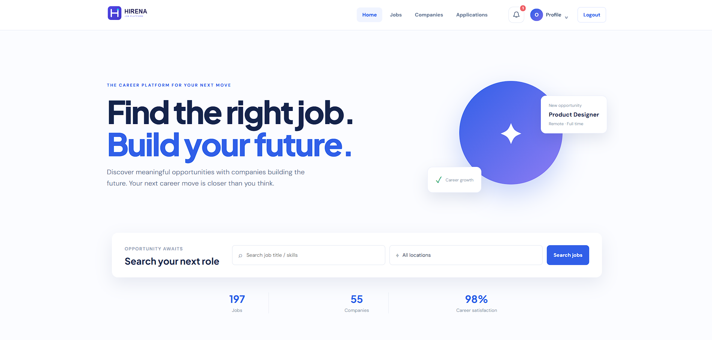 | 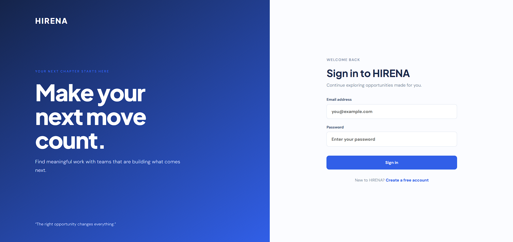 |

| Home Page Alternate View | Job Search |
|---|---|
| 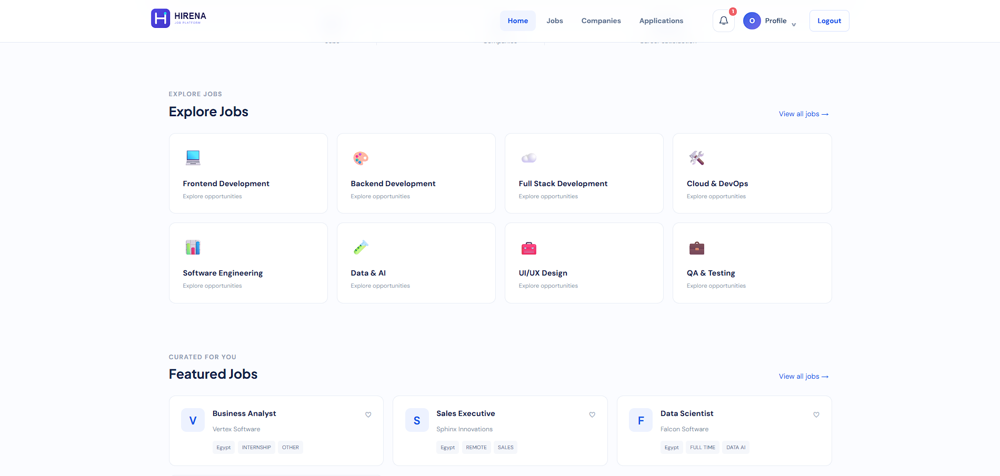 | 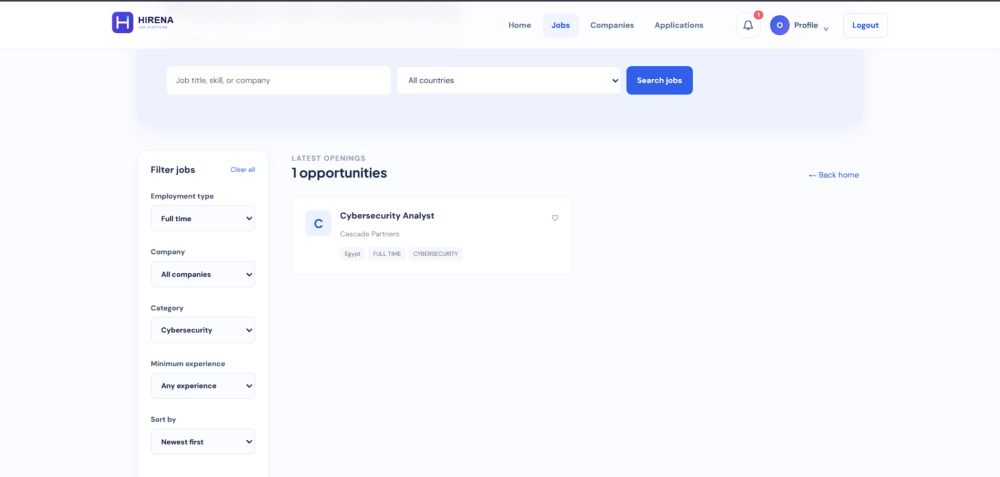 |

### Job Seeker

| Job Details | My Applications |
|---|---|
| 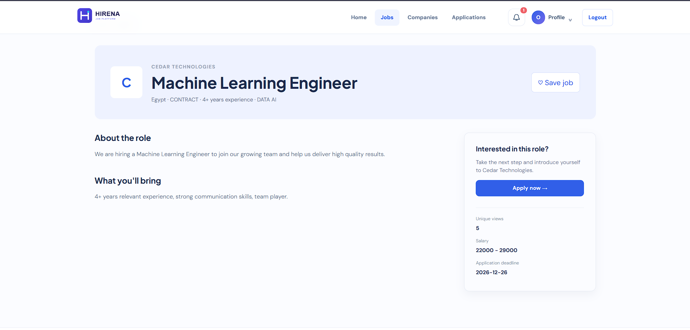 | 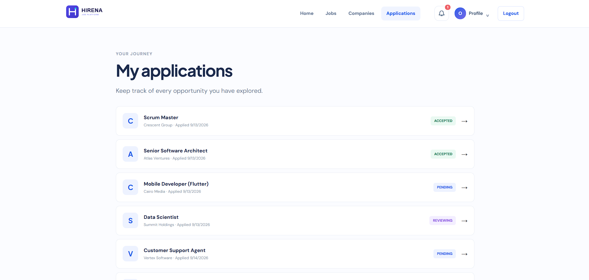 |

| Notifications | Company Details |
|---|---|
| 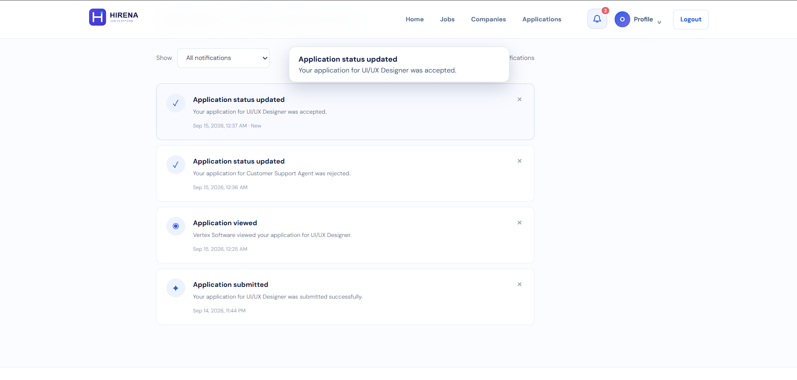 | 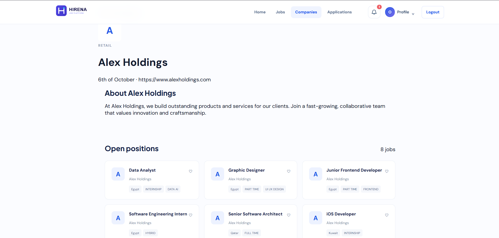 |

### Company

| Company Dashboard | Job Details Dashboard |
|---|---|
| 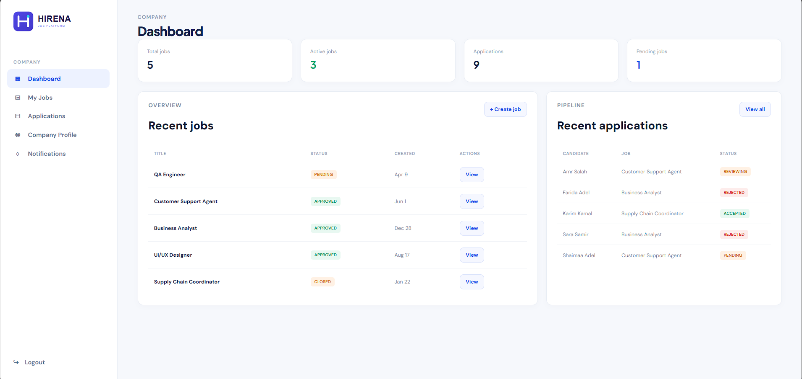 | 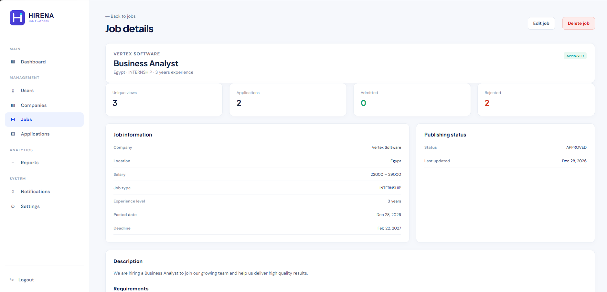 |

| Applications by Job | Gemini CV Analysis |
|---|---|
| 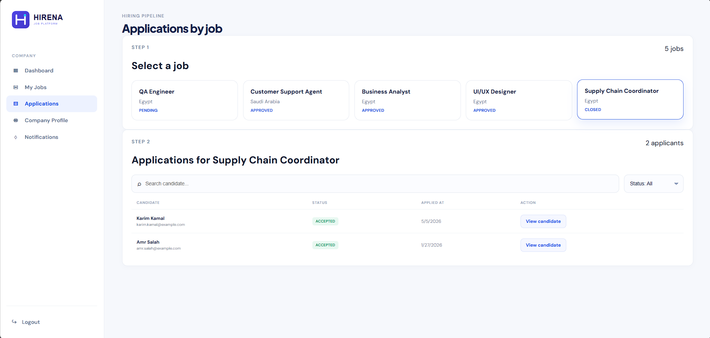 | 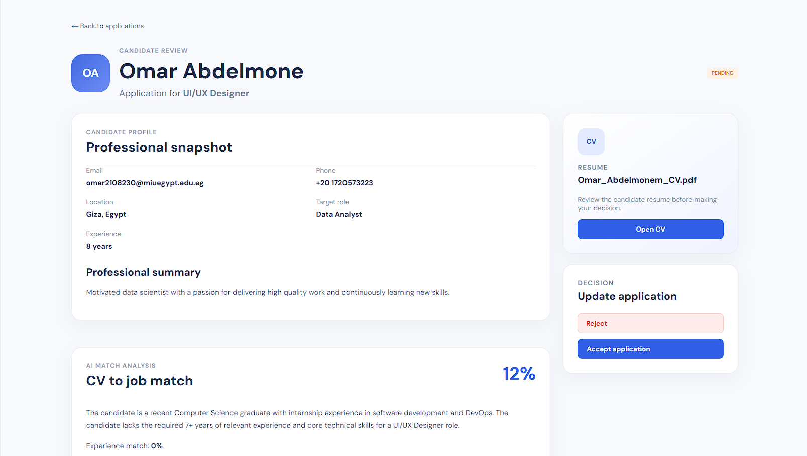 |

### Admin

| Admin Dashboard | Users |
|---|---|
| 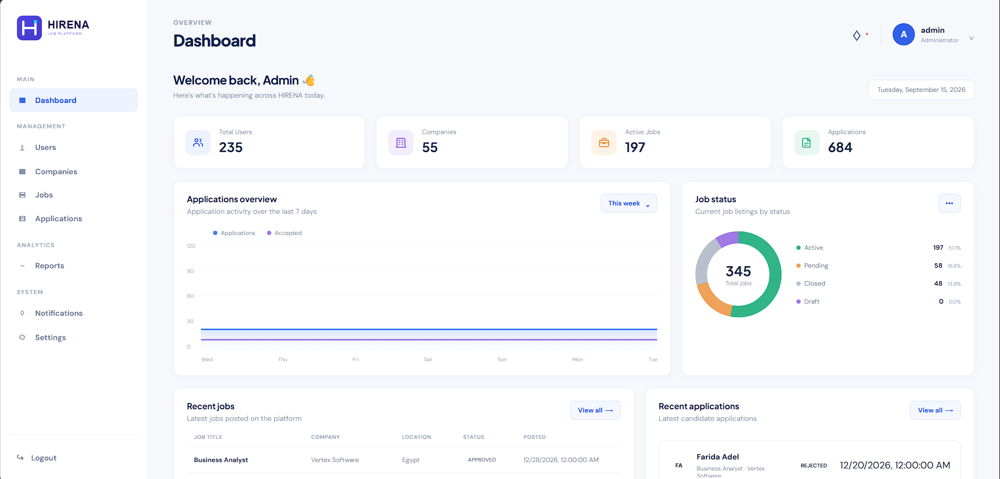 | 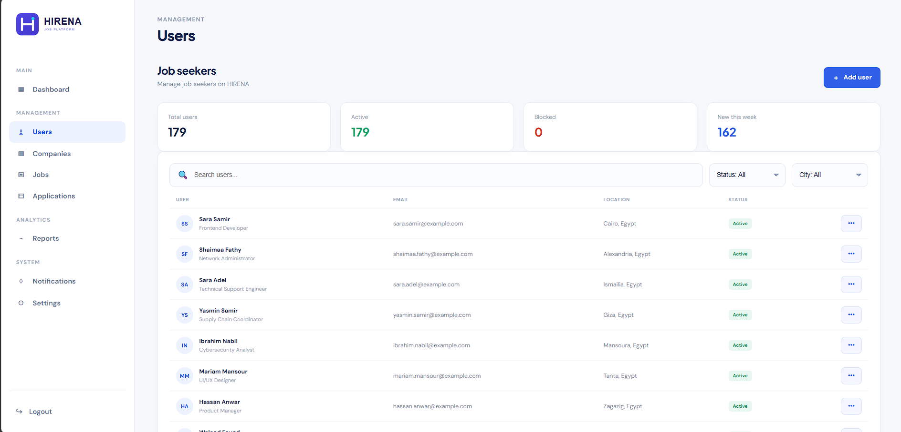 |

| Admin Management |
|---|
| 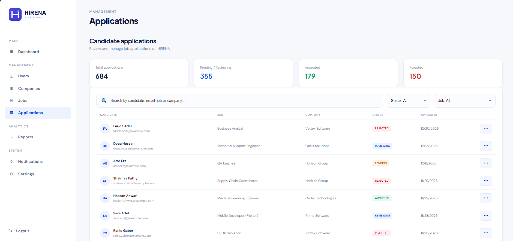 |

## Technology Stack

### Frontend

- React
- Vite
- Axios
- React Router
- STOMP.js
- Nginx

### Backend

- Java 21
- Spring Boot 4
- Spring MVC
- Spring Data JPA / Hibernate
- Spring Security
- JWT
- Spring WebSocket
- Spring Kafka
- Spring Mail
- Maven

### Infrastructure

- PostgreSQL 16
- Apache Kafka 3.8
- Docker
- Docker Compose

## Roles

- **Candidate** - search and apply for jobs, manage profile and CV
- **Company** - create jobs and manage applications
- **Admin** - manage users and platform data

## Repository Structure

```text
HIRENA/
├── hirena-backend/       # Spring Boot backend
├── hirena-frontend/      # React frontend
├── docs/screenshots/     # Application screenshots
├── docker-compose.yml    # Application infrastructure
├── .env.example          # Environment variable template
└── README.md
```

## Quick Start

### Prerequisites

- Docker Desktop
- Git

### Run with Docker

```powershell
git clone https://github.com/OmarAbdelmonem1/HIRENA.git
cd HIRENA
Copy-Item .env.example .env
docker compose up -d --build
```

Open the application:

```text
http://localhost:5173
```

To view the backend logs:

```powershell
docker compose logs -f backend
```

To stop the application without deleting database volumes:

```powershell
docker compose down
```

## License

This project is developed for **demonstration and portfolio purposes**.
